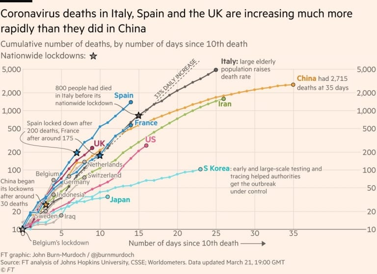

# NGSprint hackathon

Hello and welcome to the NGSprint Data Visualization hackathon!

## tl;dr

You will find materials and instructions for the Data Visualization hackathon during NGSprint event.

**When**: 8 - 15.09.2021  
**Where**: Discord & Zoom

More info about the event can be found on [the website](https://ngschool.eu/ngsprint/). 

## Aim

During this hackathon we will explore what makes a good figure and how to avoid common pitfalls. We will discuss which rules are important and which we can treat as suggestions. 

## Preparation

The tutorial part of the hackathon will be run in R, therefore you will need:

* A recent version of R [(download fromhere)](https://cloud.r-project.org/);
* A recent version of RStdudio [(download from here)](https://www.rstudio.com/products/rstudio/download/#download)
* packages listed in `prep_help.R` (you will also find helper functions to install the packages in the file).

~~If you run into issues installing R and RStudio you can try [RStudio Cloud](https://rstudio.cloud/projects) - you will need to set up an account and install the packages using the code in the `prep_help.R` file.~~ <- edited as the RStudio Cloud free account does not give enough resources. 

### Previous knowledge

If you don't feel confident using R I would highly recommend going through some of the [NGSeminars](https://ngschool.eu/ngseminars2020/), especially:

* **Introduction to R** [[YouTube recording](https://youtu.be/zrqIhS2zUFk), [GitHub repository](https://github.com/NGSchoolEU/NGSeminaR)] by [Maja Kuzman](https://twitter.com/maja_kuzman)  
* **R for Data Science (with tidyverse and ggplot2)** [[YouTube recording](https://youtu.be/G8cGmdrCsUs), [GitHub repository](https://github.com/sienkie/R_for_data_science)] by [Karolina Sienkiewicz](https://twitter.com/sienkieee)  
* **R - functions and fundamentals** [[YouTube recording](https://youtu.be/Rh9K5tHOm1c), [GitHub repository](https://github.com/anamariaelek/NGSeminar)] by [Anamaria Elek](https://twitter.com/anamariaelek)  

## Materials

* [Fundamentals of Data Visualization](https://clauswilke.com/dataviz/) by [Claus O. Wilke](https://twitter.com/ClausWilke)
* [Data Visualization: A Practical Introduction.](https://socviz.co/index.html) by [Kieran Healy](https://twitter.com/kjhealy)
* [SDS 375/395 Data Visualization in R](https://wilkelab.org/SDS375/syllabus.html) @ University of Texas at Austin by [Claus O. Wilke](https://twitter.com/ClausWilke) and Anastasiya Kulikova.
* [Data Visualization SOCIOL 880](http://socviz880.co/) @ Duke University by [Kieran Healy](https://twitter.com/kjhealy)

## Famous data visualizations

* [COVID-19 tracker @ Financial Times](https://www.ft.com/content/a2901ce8-5eb7-4633-b89c-cbdf5b386938) by [John Burn-Murdoch](https://twitter.com/jburnmurdoch)

This was a groundbreaking visualisation that allowed to compare countries 

[John Burn-Murdoch keynote @ RSTUDIO::GLOBAL 2021](https://www.rstudio.com/resources/rstudioglobal-2021/reporting-on-and-visualising-the-pandemic/)

* [1854 Broad Street cholera outbreak map](https://en.wikipedia.org/wiki/1854_Broad_Street_cholera_outbreak) by John Snow

