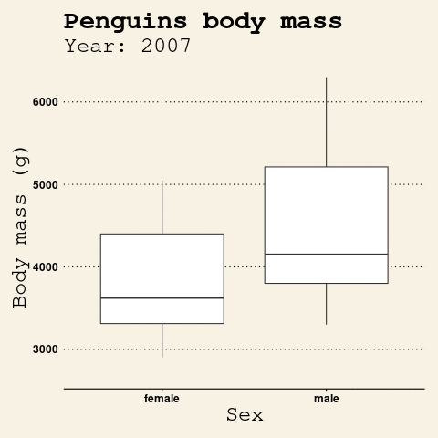

```{r setup, include=FALSE}
library(tidyverse)
library(ggsci)
library(patchwork)
library(GGally)
library(ggridges)
library(ggthemes)
library(palmerpenguins)
library(learnr)
library(gradethis)
knitr::opts_chunk$set(comment = "", echo = FALSE,
                      fig.width = 7)
```

## Introduction

### Setup 

We start by loading all the necessary packages. There's quite a few, but they will allow us to make pretty plots. 

Throughout this tutorial we will use various plot themes, we will change the various aspects of the plots aesthetics to get comfortable with customizing the figures. We will see Some of them will help us tell the story, others will be a matter of taste. In all cases we will learn how to plot the data, how to change the way it is plotted, but also, you will hopefully learn which themes and settings you like most. 

```{r library-calls, echo = TRUE, eval = FALSE}
# the package of all packages 
library(tidyverse) 
# penguins data set
library(palmerpenguins)
# scientific journal and sci-fi themed color palettes
library(ggsci)
# various themes for ggplot2 plots
library(ggthemes)
# composer of plots 
library(patchwork)
# dealing with overlapping densities
library(ggridges)
# pairwise plots
library(GGally)
```

### LTER Penguins

Data visualization warm up with creating data visualizations in general. 

In this tutorial we will work primarly with the penguins dataset. 

{width="75%"}

The `penguins` dataset contains information about 344 penguins - their specie name, the island they are from, their sex and year the measurements were taken; together with measurements: bill length and depth, flipper length, and body mass.

{width="75%"}

Let's see few random rows to get a better sense of the data.

```{r slice, exercise = TRUE, exercise.eval = TRUE}
penguins %>%
  slice_sample(n = 3)
```

We can look at the dataset with the built-in function `summary()`, although it is a little bit messy. That's where data visualization comes in handy! 

```{r penguins_summary, exercise = TRUE, exercise.eval = TRUE}
penguins %>%
  summary()
```

But before we move on to the data visualization we need to check if we have missing data. 

```{r penguins_nas, exercise = TRUE, exercise.eval = TRUE}
penguins %>%
  filter(!complete.cases(.))
```

As you can see we have 11 observations with missing `sex`, including two which are missing `bill` and `flipper` measurements as well. 

There are many ways to deal with the missing data:

* we can delete the observations that are missing observations, 
* we can fill them with mean or median value for the group, 
* we can impute them using models for example k-nearest neighbors 
* or even use sophisticated models to generate the missing observations. 

How you deal with missing data is very much data, analysis and sometimes, personal preference, dependent. In this case, we will simply ignore the observations, as the goal of the tutorial is to create nice visualizations. Outside of the tutorial I would strongly recommend you take great care with missing data. 

Further reading on missing data:

* [Missing data: A statistical framework for practice](https://lshtm.sharepoint.com/:b:/s/MissingDataPublicFiles/EUTYOXgfhT5Nqf2iQtWIro8BTCQ2GCvC1sl61kJ0_UWneg?e=ruMwcl) by James R. Carpenter and Melanie Smuk from London School of Hygiene & TropicalMedicine, London, UK
* [LSHM hub with resources on missing data](https://www.lshtm.ac.uk/research/centres-projects-groups/missing-data)
* [Understanding and Handling Missing Data](https://www.inwt-statistics.com/read-blog/understanding-and-handling-missing-data.html) by marina wyss

Let's filter out the missing data and create a data frame we will be working from now on.

```{r penguins_complete_cases, exercise = TRUE}
penguins_complete_df <-
  penguins %>%
```

```{r penguins_complete_cases-solution}
penguins_complete_df <-
  penguins %>%
  filter(complete.cases(.))
```


```{r penguins_complete_cases-code-check}
grade_this_code(correct = "Great, now we are ready for data visualization!")
```


## Data summaries

```{r penguins_complete_df}
penguins_complete_df <-
  penguins %>%
  filter(complete.cases(.))
```

First thing we want to understand about the data are summaries:

* how many observations per type do we have?  
* what is the distribution of the values?
* what groups do we have in the data?

### Barplots 

Let's start with basics - how many penguins per specie do we have in the dataset? Below, you see two plots presenting the same information with slightly modified, customized looks. In my opinion, panel `b` is more readable; however, the changes here are more cosmetic than substantial. Precisely why they are a great opportunity to tweak `ggplot2`.

```{r specie_plots, fig.width = 8, fig.height = 4}
minimal_plt <- 
  penguins_complete_df %>%
  ggplot(aes(x = species)) +
  geom_bar(aes(fill = species)) +
  theme(legend.position = "bottom")

better_plt <- 
  penguins_complete_df %>%
  ggplot(aes(species)) +
  geom_bar(aes(fill = species)) +
  geom_label(data = (penguins %>% 
                      group_by(species) %>% 
                      summarise(count = n())),
            aes(x = species, y = count, label = count)) +
  theme_classic() +
  theme(legend.position = "none", 
        axis.title = element_blank()) +
  labs(title = "Number of penguins per specie")

minimal_plt + better_plt + 
  plot_annotation(tag_levels = 'a')
```

Let's start with recreating the minimal example, panel `a`.

```{r specie, exercise = TRUE, fig.width = 4, fig.height = 3, exercise.blanks = "___+"}
penguins_complete_df %>%
  ggplot(aes(x = ___)) +
  geom_bar(aes(fill = ___))  +
  theme(legend.position = ___)
```

```{r specie-solution}
penguins_complete_df %>%
  ggplot(aes(x = species)) +
  geom_bar(aes(fill = species)) +
  theme(legend.position = "bottom")
```

And now, let's try to customize it such that it resembles the panel `b`.

```{r specie_custom, exercise = TRUE, fig.width = 4, fig.height = 3, exercise.blanks = "___+"}
penguins_complete_df %>%
  ggplot(aes(x = ___)) +
  geom_bar(aes(fill = ___)) +
  geom_label(data = (penguins %>% 
                      group_by(___) %>% 
                      summarise(count = n())),
            aes(x = ___, y = ___, label = ___)) +
  theme_classic() +
  theme(___ = "none") +
  labs(x = ___. y = ___. 
       title = ___)
```


```{r specie_custom-solution}
# this is a more complicated, but easier to read figure
penguins_complete_df %>%
  ggplot(aes(species)) +
  geom_bar(aes(fill = species)) +
  geom_label(data = (penguins %>% 
                      group_by(species) %>% 
                      summarise(count = n())),
            aes(x = species, y = count, label = count)) +
  theme_classic() +
  theme(legend.position = "none") +
  labs(x = "Specie", y = "Count", 
       title = "Number of penguins per specie")
```

### Histograms

Next thing we want to know is the distribution of values. For that we can use histograms. `binwith` is the parameter controlling the width of the bar - i.e. it controls the width of the interval in which observations will be counted. What is the best value of `binwith` for body mass? Try multiple options and observe how the plot changes.

```{r body_mass_hist, echo = FALSE}
sliderInput(
  "binwidth", 
  "Binwidth:", 
  min = 10, max = 1000, value = 50
  )
plotOutput("hist")
```

```{r body_mass_hist_plot, context = "server"}
output$hist <- 
  renderPlot({
    penguins_complete_df %>%
      ggplot(aes(body_mass_g)) +
      geom_histogram(binwidth =  input$binwidth) +
      labs(x = "Body mass (g)", 
           y = "Count", 
           title = "Distribution of body mass") +
      theme_linedraw()
  })
```

```{r hist, exercise = TRUE, exercise.blanks = "___+"}
penguins_complete_df %>%
  ggplot(aes(body_mass_g)) +
  geom_histogram(binwidth = ___)  +
  labs(x = "Body mass (g)", 
       y = "Count", 
       title = "Distribution of body mass") +
  theme_linedraw()
```

```{r hist-solution}
penguins_complete_df %>%
  ggplot(aes(body_mass_g)) +
  geom_histogram(binwidth = 100)  +
  labs(x = "Body mass (g)", 
       y = "Count", 
       title = "Distribution of body mass") +
  theme_linedraw()
```

Alternatively, we can use `bins` parameter which will create intervals based on the amount of bars we want to see on the plot.

```{r body_mass_hist2, echo = FALSE}
sliderInput(
  "bins", 
  "Number of bins:", 
  min = 1, max = 300, value = 20
  )
plotOutput("hist2")
```

```{r body_mass_hist2_plot, context = "server"}
output$hist2 <- 
  renderPlot({
    penguins_complete_df %>%
      ggplot(aes(body_mass_g)) +
      geom_histogram(bins =  input$bins) +
      labs(x = "Body mass (g)", 
           y = "Count", 
           title = "Distribution of body mass") +
      theme_linedraw()
  })
```

### Densities

Another way to look at the distribution of data is to look at the `geom_density`. 

```{r density_length_sex, exercise = TRUE, exercise.eval = TRUE, exercise.lines	= 22}
# helper tibble to clean up the facet titles
better_facets_df <-
  tibble(measurement_type = c("bill_depth_mm", 
                              "bill_length_mm", 
                              "flipper_length_mm",
                              "body_mass_g"),
         measurement_title = c("Bill depth (mm)",
                               "Bill length (mm)",
                               "Flipper length (mm)",
                               "Body mass (g)"))

penguins_complete_df %>%
  pivot_longer(names_to = "measurement_type",
               values_to = "value",
               c(ends_with("mm"))) %>%
  ggplot(aes(value, fill = sex)) +
  geom_density(alpha = 0.4) +
  facet_wrap(~measurement_type, scales = "free", ncol = 1) +
  scale_fill_jco() +
  theme_linedraw() +
  theme(axis.title.x = element_blank(), legend.position = "none") +
  labs(y = "Density")
```

We can improve the plot by removing the overlap which introduces the feeling of messiness.

```{r density_ridges_length_sex, exercise = TRUE, exercise.eval = TRUE}
penguins_complete_df %>%
  pivot_longer(names_to = "measurement_type",
               values_to = "value",
               c(ends_with("mm"))) %>%
  left_join(better_facets_df) %>%
  ggplot(aes(value, y = sex, fill = sex)) +
  geom_density_ridges() +
  facet_wrap(~measurement_title, scales = "free", ncol = 1) +
  scale_fill_jco() +
  theme_linedraw() +
  theme(axis.title = element_blank(), 
        legend.position = "none") +
  labs(title = "Bill and flipper dimensions with respect to sex",
       subtitle = paste("Dimensions for Adelie, Chinstrap and Gentoo",
                        "Penguins at Palmer Station LTER"))
```

Now, let's investigate those measurements with respect to specie.

```{r density_ridges_length_specie, exercise = TRUE, exercise.blanks = "___+"}
penguins_complete_df %>%
  pivot_longer(names_to = "measurement_type",
               values_to = "value",
               c(ends_with("mm"))) %>%
  left_join(better_facets_df) %>%
  ggplot(aes(value, y = ___, fill = ___)) +
  geom_density_ridges(rel_min_height = 0.01) + 
  facet_wrap(~___, scales = ___, ncol = 1) +
  scale_fill_manual(values = c("darkorange", "purple", "cyan4")) +
  theme(axis.title = element_blank(), 
        legend.position = ___) +
  labs(title = "Bill and flipper dimensions with respect to specie",
       subtitle = paste("Dimensions for Adelie, Chinstrap and Gentoo",
                        "Penguins at Palmer Station LTER"))
```


```{r density_ridges_length_specie-solution}
penguins_complete_df %>%
  pivot_longer(names_to = "measurement_type",
               values_to = "value",
               c(ends_with("mm"))) %>%
  left_join(better_facets_df) %>%
  ggplot(aes(value, y = species, fill = species)) +
  geom_density_ridges(rel_min_height = 0.01) + 
  facet_wrap(~measurement_title, scales = "free", ncol = 1) +
  scale_fill_manual(values = c("darkorange", "purple", "cyan4")) +
  theme(axis.title = element_blank(), 
        legend.position = "none") +
  labs(title = "Bill and flipper dimensions with respect to specie",
       subtitle = paste("Dimensions for Adelie, Chinstrap and Gentoo",
                        "Penguins at Palmer Station LTER"))
```

### Boxplots, violin plots

Boxplots allow us to summarize our data providing visual guide to values such as `median` and `quartiles`. Violin plots provide a compact visualization of continuous distributions.

{width=70%}

Quartile - special case of quantile - point that split distribution into equal parts. There are 3 quartiles: Q1, Q2, and Q3. Q1, also called lower quartile, splits off the lowest 25% of data from the highest 75%. Q2, also called median, cuts the data in half. Q3, in turn, splits off the highest 25% of data from the lowest 75%. Another special case of quantiles are percentiles (they split the data into 1% slices). Q1 is equivalent of 25th percentile, Q2 of 50th and Q3 of 75th percentile.
Interquartile range (IQR) - spread between upper and lower quartile; IQR = Q3 - Q1 


```{r boxplot_q1, echo = FALSE}
question("What percent of the data lies between lower and upper quartile?",
  answer("25%"),
  answer("33%"),
  answer("50%", correct = TRUE),
  answer("66%"),
  random_answer_order = TRUE
)
```

```{r boxplot_q2, echo = FALSE}
question("What percent of the data lies between the whiskers - i.e. the furthest lines of the boxplot?",
  answer("100%"),
  answer("98%"),
  answer("99.3%", correct = TRUE),
  answer("95%"),
  random_answer_order = TRUE
)
```


```{r box_violin, exercise = TRUE, exercise.eval = TRUE, exercise.lines	= 29, fig.width = 10, fig.width = 4}
violin_box_plt <- 
  penguins_complete_df %>%
  ggplot(aes(species, body_mass_g, group = interaction(species, sex))) +
  geom_violin(aes(fill = sex),
              position = position_dodge(width = 0.9)) +
  geom_boxplot(outlier.size = 0, width = 0.2,
               position = position_dodge(width = 0.9)) +
  theme_clean() +
  scale_fill_jco() +
  theme(legend.position = "bottom", axis.title.x = element_blank()) +
  labs(title = "Penguins body mass with respect to species",
       y = "Body mass (g)",
       fill = "Sex")

jitter_box_plt <-
penguins_complete_df %>%
  ggplot(aes(x = species, y = body_mass_g, group = interaction(species, sex))) +
  geom_point(aes(color = sex), position = position_jitterdodge()) +
  geom_boxplot(alpha = 0.6, outlier.size = 0, 
                position = position_dodge2(padding = 0.7)) +
  theme_clean() +
  scale_color_jco() +
  theme(legend.position = "bottom", axis.title.x = element_blank()) +
  labs(title = "Penguins body mass with respect to species",
       y = "Body mass (g)",
       color = "Sex")

violin_box_plt + jitter_box_plt +
  plot_annotation(tag_levels = 'a')
```

**Questions** 

* Which of the above - panel `a` or panel `b` you like more? Why?  
* What you can see in one but not the other and vice versa?    

## Trends in data

Now we will investigate x-y relationships. How does y change depending on x? Is there some 

What is the relationship between bill and flipper length?  

```{r bill_flipper, exercise = TRUE, exercise.eval = TRUE, fig.width = 7}
penguins_complete_df %>%
  ggplot(aes(bill_length_mm, flipper_length_mm)) +
  geom_point() +
  geom_smooth(se = FALSE, method = "lm", formula = "y ~ x") +
  labs(x = "Bill length (mm)",
       y = "Flipper length (mm)",
       title = "Correlation between flipper and bill length")  +
  theme_economist() + 
  scale_colour_economist() 
```

And what about body mass and bill depth?

```{r body_bill, exercise = TRUE, exercise.eval = TRUE, fig.width = 7}
penguins_complete_df %>%
  ggplot(aes(body_mass_g, bill_depth_mm)) +
  geom_point() +
  geom_smooth(se = FALSE, method = "lm", formula = "y ~ x") +
  labs(x = "Body mass (g)",
       y = "Bill depth (mm)",
       title = "Bill depth as a function of body mass") +
  theme_wsj() +
  theme(title = element_text(size = 16))
```

Why can that plot be misleading? 

### Simpson's paradox

It's a perfect time to read up on phenomenon in which the trend in several groups appears to be a reverse of the trend for all groups together. It is commonly known as Simpson's paradox
(although some argue this is not a paradox). More on [wikipedia](https://en.wikipedia.org/wiki/Simpson's_paradox) and in a [nice video by minutephysics](https://www.youtube.com/watch?v=ebEkn-BiW5k).


```{r body_bill_paradox, exercise = TRUE, exercise.blanks = "___+"}
penguins_complete_df %>%
  ggplot(aes(body_mass_g, bill_depth_mm, color = ___)) +
  geom_point() +
  geom_smooth(se = FALSE, method = "lm") +
  scale_color_manual(values = c("darkorange", "purple", "cyan4")) +
  labs(x = "Body mass (g)",
       y = "Bill depth (mm)",
       title = "Bill depth as a function of body mass") +
  theme_wsj() +
  theme(title = element_text(size = 16))
```

```{r body_bill_paradox-solution}
penguins_complete_df %>%
  ggplot(aes(body_mass_g, bill_depth_mm, color = species)) +
  geom_point() +
  geom_smooth(se = FALSE, method = "lm") +
  scale_color_manual(values = c("darkorange", "purple", "cyan4")) +
  labs(x = "Body mass (g)",
       y = "Bill depth (mm)",
       title = "Bill depth as a function of body mass") +
  theme_wsj() +
  theme(title = element_text(size = 16))
```

**Exercise:** If we simply plot bill dimensions we can't see much organization to the data. Is there something interesting you can show by adding the colors `aes(color = ?)` and/or splitting the data by a variable `facet_wrap(~?)`? 

```{r bills_sex, exercise = TRUE, exercise.eval = TRUE}
penguins_complete_df %>%
  ggplot(aes(x = bill_length_mm, y = bill_depth_mm)) +
  geom_point() +
  theme_linedraw() +
  theme(legend.position = "none") +
  labs(x = "Bill length (mm)",
       y = "Bill depth (mm)",
       title = "Bill dimensions",
       subtitle = paste("Dimensions for Adelie, Chinstrap and Gentoo",
                        "Penguins at Palmer Station LTER"))
```

```{r bills_sex-solution}
# that's just one of the options
penguins %>%
  filter(complete.cases(.)) %>%
  ggplot(aes(x = bill_length_mm, y = bill_depth_mm, color = sex)) +
  geom_point() +
  geom_smooth(method = "lm", se = FALSE, color = "black") +
  scale_color_jco() +
  theme_linedraw() +
  theme(legend.position = "none") +
  facet_wrap(~species) +
  labs(x = "Bill length (mm)",
       y = "Bill depth (mm)",
       title = "Bill dimensions",
       subtitle = paste("Dimensions for Adelie, Chinstrap and Gentoo",
                        "Penguins at Palmer Station LTER"))
```


We can also plot all the relationships at once using the baseR function. 

```{r baseR_plot, exercise = TRUE, exercise.eval = TRUE, fig.width = 7}
penguins_complete_df %>%
  select(bill_length_mm, bill_depth_mm, 
         flipper_length_mm, body_mass_g) %>%
  pairs()
```

However, it is quite difficult to customise it.

```{r baseR_ext_plot, exercise = TRUE, exercise.eval = TRUE, fig.width = 7}
penguins_complete_df %>%
  select(bill_length_mm, bill_depth_mm, 
         flipper_length_mm, body_mass_g) %>%
  pairs(bg = c("darkorange", "purple", "cyan4")[unclass(penguins_complete_df$species)], 
        pch = 21, 
        labels = c("Bill length (mm)", "Bill depth (mm)", 
                   "Flipper length (mm)", "Body mass (g)"),
                   oma = c(3, 3, 3, 15))
                   
par(xpd = TRUE)
legend("bottomright", 
       fill = c("darkorange", "purple", "cyan4"),
       legend = levels(penguins_complete_df$species))
```

We can create such plots using `GGally` package. Read more about the package in the [online manual](https://ggobi.github.io/ggally/index.html).

```{r ggpairs, message = FALSE, exercise = TRUE, exercise.eval = TRUE, fig.width = 7}
penguins_complete_df %>%
  ggpairs(columns = c("bill_length_mm", "bill_depth_mm", 
                      "flipper_length_mm", "body_mass_g"),
          columnLabels = c("Bill length (mm)", "Bill depth (mm)", 
                           "Flipper length (mm)", "Body mass (g)"),
          mapping = aes(color = species), 
          upper = list(continuous = wrap(ggally_cor, display_grid = FALSE)),
          diag = list(continuous = wrap(ggally_densityDiag, alpha = 0.7)),
          title = "Scatter plot of dimensions of Penguins at Palmer Station LTER") +
  scale_color_manual(values = c("darkorange", "purple", "cyan4")) +
  scale_fill_manual(values = c("darkorange", "purple", "cyan4")) 
```

```{r ggpairs_q1, echo = FALSE}
question("Which method does the `ggpairs` function use on default to calculate correlations?",
  answer("spearman"),
  answer("kendall"),
  answer("pearson", correct = TRUE),
  random_answer_order = TRUE
)
```


## More complex visualizations

### UpSet

Venn (Euler) Diagrams are plots with typically overlapping circles or ellipsis that show the amount of overlap between sets (panel `a` on a figure below). They are suitable for up to 3 sets, but are very hard to read for more than that (look at banana figure below). When the number of sets increases, UpSet plots are a great alternative to Venn (Euler) Diagrams (panel `c`).

](images/upset_plot.jpg){width=60%}

To read more about UpSetR please refer [here](https://jku-vds-lab.at/tools/upset/).

```{r upset, exercise = TRUE, exercise.eval = TRUE}
library(UpSetR)
mutations <- read.csv(system.file("extdata", "mutations.csv", 
                                  package = "UpSetR"),
                      header = T, sep = ",")

upset(mutations, sets = c("PTEN", "TP53", "EGFR", "PIK3R1", "RB1"), 
      sets.bar.color = "#56B4E9",
      order.by = "freq", empty.intersections = "on")
```

### Heatmap

There are multiple packages that help plot the heatmaps, however, in my opinion, [ComplexHeatmap](https://jokergoo.github.io/ComplexHeatmap-reference/book/) is the one that allows the highest degree of customisation and comes with extensive manual. I highly recommend. 

```{r heatmap, exercise = TRUE, exercise.eval = TRUE, exercise.lines= 33, warning = FALSE, message = FALSE}
library(ComplexHeatmap)

penguins_mat <- 
  penguins_complete_df %>%
  select(bill_length_mm, bill_depth_mm, 
         flipper_length_mm, body_mass_g) %>%
  as.matrix()

sex_cols <- pal_jco()(2)
names(sex_cols) <- levels(penguins_complete_df$sex)

species_cols <- c("darkorange", "purple", "cyan4")
names(species_cols) <- levels(penguins_complete_df$species)

column_labels <- 
  c("Bill depth (mm)",  "Bill length (mm)",
    "Flipper length (mm)",  "Body mass (g)")

names(column_labels) <- 
  c("bill_depth_mm", "bill_length_mm", 
    "flipper_length_mm",  "body_mass_g")

ha <-
  HeatmapAnnotation(Species = penguins_complete_df$species,
                    Sex = penguins_complete_df$sex, which = "row",
                    col = list(Sex = sex_cols, Species = species_cols))

penguins_ht <- 
  Heatmap(scale(penguins_mat), col = viridis::viridis(100),
        cluster_columns = FALSE, split = 3, column_names_rot = 45,
        column_labels = column_labels[colnames(penguins_mat)], 
        name = "Scaled measurement", right_annotation = ha)

penguins_ht
```

### Interactivity

There are many ways to create interactive plots in R, but by far the easiest is with `plotly` package. You can learn more about the package [here](https://plotly.com/r/).

Try selecting and deselecting particular specie. Or zooming in to see particular observation. 

```{r plotly, exercise = TRUE, exercise.eval = TRUE, warning = FALSE, message = FALSE}
library(plotly)
paradox_plot <-
  penguins_complete_df %>%
  ggplot(aes(body_mass_g, bill_depth_mm, color = species)) +
  geom_point() +
  geom_smooth(se = FALSE, method = "lm") +
  scale_color_manual(values = c("darkorange", "purple", "cyan4")) +
  labs(x = "Body mass (g)",
       y = "Bill depth (mm)",
       title = "Bill depth as a function of body mass",
       color = "Species") +
  theme_wsj() +
  theme(title = element_text(size = 16), legend.position = "right", 
        legend.direction = "vertical")

ggplotly(paradox_plot)
```

Ps. ComplexHeatmap can be also easily turned into an interactive heatmap - you just need one more package `InteractiveComplexHeatmap`. I highly recommend to give it a go! Read more [here](https://jokergoo.github.io/InteractiveComplexHeatmap/articles/InteractiveComplexHeatmap.html).

### Animation

In some cases, it is quite helpful to represent the data as an animation. The best package to start creating animations in R with is `gganimate`. Read more about, and browse examples for inspiration, [here](https://gganimate.com/).

Creating the animation was slowing down the tutorial, therefore I executed the code earlier, saved the animation and load it in from file.

```{r animation, echo = TRUE, eval = FALSE}
library(gganimate)
penguins_complete_df %>%
  ggplot(aes(sex, body_mass_g)) + 
  geom_boxplot() + 
  # Here comes the gganimate code
  transition_states(
    year,
    transition_length = 2,
    state_length = 1
  ) +
  enter_fade() + 
  exit_shrink() +
  ease_aes('sine-in-out') +
  # the end of gganimate code, now, just cosmetic changes
  theme_wsj() +
  theme(axis.title = element_text()) +
  labs(title = "Penguins body mass",
       subtitle = 'Year: {closest_state}',
       x = "Sex",
       y = "Body mass (g)")

anim_save("images/gganimate_demo.gif")
```



## Great Data Viz R Resources

Used in this tutorial:

* [palmerpenguins](https://allisonhorst.github.io/palmerpenguins/index.html) - Great toy dataset for data exploration & visualization
* [tidyverse](https://www.tidyverse.org/) - world of gold R packages for data wrangling, exploration and visualization; [core tidyverse](https://www.tidyverse.org/packages/#core-tidyverse) packages include: [ggplot2](https://ggplot2.tidyverse.org/), [dplyr](https://dplyr.tidyverse.org/), [tidyr](https://tidyr.tidyverse.org/), [readr](https://readr.tidyverse.org/), [purr](https://purrr.tidyverse.org/), [tibble](https://tibble.tidyverse.org/), [stringr](https://stringr.tidyverse.org/) and [forcats](https://forcats.tidyverse.org/)  
* [ggsci](https://cran.r-project.org/web/packages/ggsci/vignettes/ggsci.html) - Scientific Journal and Sci-Fi Themed Color Palettes for ggplot2 
* [ggthemes](https://mran.microsoft.com/snapshot/2016-12-03/web/packages/ggthemes/vignettes/ggthemes.html) - extra themes and geometries for ggplot2   
* [ggridges](https://wilkelab.org/ggridges/index.html) - ridgeline plots allowing for better densiies visualization
* [patchwork](https://patchwork.data-imaginist.com/index.html) - grammar for combinig multiple plots
* [GGally](https://ggobi.github.io/ggally/) - extension to ggplot2 to create pariwise plots
* [UpSetR](https://jku-vds-lab.at/tools/upset/) - better Venn Diagrams
* [ComplexHeatmap](https://jokergoo.github.io/ComplexHeatmap-reference/book/) - master package for creating customised Heatmaps
* [plotly](https://plotly.com/r/) - interactive ggplots
* [gganimate](https://gganimate.com/) - animated ggplots

Not used in this tutorial but highly recommended:

* [ggforce](https://ggforce.data-imaginist.com/) - great tools to highlighting and decorating gglots
* [ggpubr](https://rpkgs.datanovia.com/ggpubr/index.html) - ggplot2 extension to plot publication ready figures
* [ggrepel](https://cran.r-project.org/web/packages/ggrepel/vignettes/ggrepel.html) - ggplot2 extension to deal with overlapping text
* [InteractiveComplexHeatmap](https://jokergoo.github.io/InteractiveComplexHeatmap/articles/InteractiveComplexHeatmap.html) - interactivity extension for ComplexHeaatmap

Links to inspire yourself:

* [The R Graph Gallery](https://www.r-graph-gallery.com/index.html)
* [Data Imaginist](https://www.data-imaginist.com/) - blog of [Thomas Lin Pedersen](https://twitter.com/thomasp85) creator of [patchwork](https://patchwork.data-imaginist.com/index.html) and [ggforce](https://ggforce.data-imaginist.com/)
* [Website](https://clauswilke.com/) of [Claus O. Wilke](https://twitter.com/clauswilke) - author of [Fundamentals of Data Visualization (book)](https://clauswilke.com/dataviz/) and [ggridges (package)](https://wilkelab.org/ggridges/index.html) 

## Exercises

1. Explain why Anscombe's quartet is a great example of importance of data visualization. Don't forget to add a plot to you explanation!

```{r anscombe, exercise = TRUE, exercise.lines	= 25}

```

2. Put together a visually appealing infographic describing the Palmer Penguins data set. Select the key figures, decorate them with key annotations and showcase the most important things about the dataset. Write down the points you want to make and the stories you want to tell by those figures.

```{r infographic, exercise = TRUE, exercise.lines	= 25}

```


## Project

Now that you've created and customised many figures it's time for you to tell the story. Each group will be now assigned another dataset. Your task is to explore it and tell its **story**. You can create an R notebook, a GDoc with copied figures, blog post or an infographic. 
